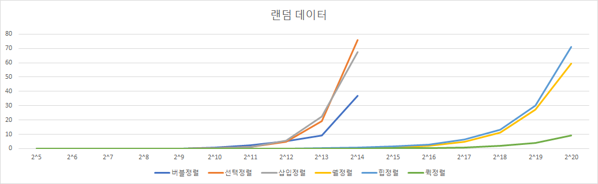

# 정렬 알고리즘 비교 (버블, 선택, 삽입, 쉘, 힙, 퀵)

## 비교 기준

6개의 정렬에 대한 성능 분석을 진행한다.
- 입력 데이터:32,64,128....1048576(2의20승)
- 정렬된 데이터,랜덤 데이터,역 정렬 데이터로 구분하여 진행.
- 계산 시간이 오래 걸릴 경우는 그 이상 진행하지 않음.
- 코드는 깃허브에 업로드 되어진 코드를 사용함.
- 랜덤 데이터는 random을 이용하였다.
- ``` 
  random.shuffle(arr)
- 시간 측정은 time 을 이용하였다
- ``` 
    import time
    start = time.time()
    print(time.time()-start)
---
# 정렬 데이터별로 분석
## 정렬 데이터 


## 역정렬 데이터


## 랜덤 데이터



- 셋 다 공통적으로 버블정렬,선택정렬,삽입정렬이 비교적 비효율적이게 나왔고
- 쉘정렬,힙정렬,퀵정렬이 비교적 효율적이게 나왔다.

# 정렬 알고리즘별로 분석

## 버블 정렬

- 어느 상황에서든 O(N^2)이라는 시간복잡도를 가지기 때문에 큰 차이가 없다.


## 선택 정렬

- 마찬가지로 O(N^2)라는 시간복잡도를 가진다. 
- 버블정렬보다는 조금 빠르다고 하지만 크게 차이는 없는듯하다.

## 삽입 정렬

- 정렬의 되었을때의 최선의 상황에서 O(N)이고 나머지는 O(N^2)의 시간복잡도를 가진다.
- 그래프로도 정렬되었을때가 제일 효율적이게 나온다.

## 쉘 정렬

- 최선의 경우 O(N)이고 평균적일때(N^1.5), 최악의 경우(N^2)를 가진다.
- 그래프에서도 정렬되었을 때 효율이 좋고 나머지는 큰 차이 없게 나온다.
- 다른 정렬들 보다 훨씬 효율적이게 나온다.

## 힙 정렬

- 어느 상황에서나 O(NlogN)의 시간복잡도를 가지는 정렬이다.
- 그래프로도 큰 차이가 없어보인다.
## 퀵 정렬

- 최선의 경우 O(NlogN),최악의 경우 O(N^2)의 시간복잡도를 갖는 정렬이다.
- 정렬된 데이터의 경우 제일 좋은 효율을 보여준다. 

---
# 결론
- 평균적으로 쉘,힙,퀵 정렬이 효율적이게 나오고, 버블,선택,삽입 정렬이 비교적 비효율적이게 나왔다
- 공부한 시간복잡도와 비슷하게 그래프가 그려졌다. 
- 다만 랜덤데이터의 값이 특정 값 하나이기 때문에 더 많은 값들을 대입해보면 좀 더 정확해질 수 있을것이다.